# SonarQube Local Setup Guide

A step-by-step guide to install, run, scan, and view results using SonarQube locally — and integrate it into AWS CodePipeline.

---

## Table of Contents

- [Prerequisites](#prerequisites)
- [Installation & Setup](#installation--setup)
- [Visual Walkthrough](#visual-walkthrough)
- [Configuration File](#configuration-file-optional)
- [AWS CodePipeline Integration](#aws-codepipeline-integration)
- [Troubleshooting](#troubleshooting)
- [Useful Commands](#useful-commands)

---

## Prerequisites

| Tool | Version | Purpose | Download |
|------|---------|---------|----------|
| Java JDK | 21+ | Required by SonarQube & Scanner | [Download JDK 21](https://adoptium.net/temurin/releases/?version=21) |
| SonarQube | Latest (Community Edition) | Code analysis server | [Download SonarQube](https://www.sonarsource.com/products/sonarqube/downloads/) |
| SonarScanner CLI | 6.2+ | Scans your project | [Download SonarScanner](https://docs.sonarsource.com/sonarqube/latest/analyzing-source-code/scanners/sonarscanner/) |

> SonarQube requires at least **10GB of free disk space** to run stably.

---

## Installation & Setup

### Step 1 — Install Java JDK 21

```bash
brew install openjdk@21
```

```bash
echo 'export PATH="/opt/homebrew/opt/openjdk@21/bin:$PATH"' >> ~/.zshrc
```

```bash
source ~/.zshrc
```

```bash
java -version
```

Expected output: `openjdk version "21.x.x"`

**Or download directly:** [Adoptium JDK 21](https://adoptium.net/temurin/releases/?version=21)

---

### Step 2 — Download & Install SonarQube

Download the Community Edition zip from [SonarQube Downloads](https://www.sonarsource.com/products/sonarqube/downloads/), then extract it:

```bash
cd ~/Downloads
```

```bash
unzip sonarqube-<VERSION>.zip
```

```bash
mv sonarqube-<VERSION> ~/sonarqube
```

Other available editions:
- [Developer Edition](https://www.sonarsource.com/products/sonarqube/downloads/) — branch analysis, PR decoration
- [Enterprise Edition](https://www.sonarsource.com/products/sonarqube/downloads/) — portfolio management, advanced reporting
- [SonarCloud](https://sonarcloud.io/) — fully managed, no server needed

---

### Step 3 — Start SonarQube

> Make sure `SONAR_JAVA_PATH` points to JDK 21, not an older version.

```bash
export SONAR_JAVA_PATH=/opt/homebrew/opt/openjdk@21/bin/java
```

```bash
~/sonarqube/bin/macosx-universal-64/sonar.sh start
```

```bash
~/sonarqube/bin/macosx-universal-64/sonar.sh status
```

Wait ~2 minutes, then open **http://localhost:9000**

Default credentials:
- Username: `admin`
- Password: `admin`

> You'll be prompted to change the password on first login.

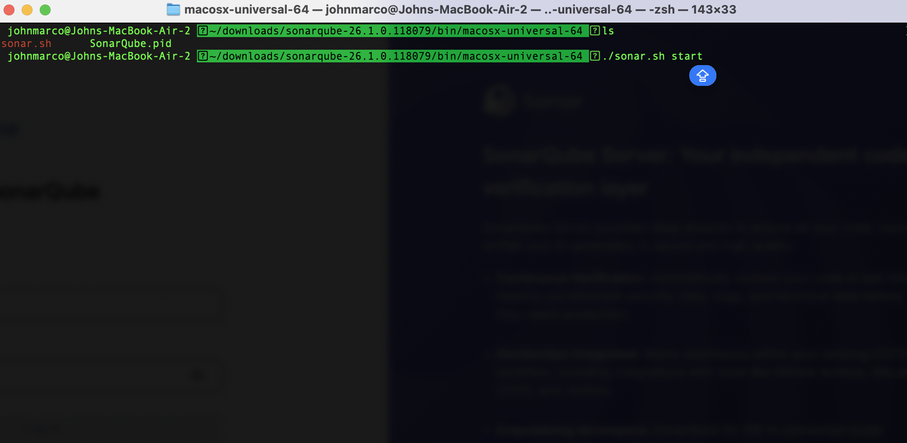

Run the `sonar.sh start` command from the terminal. This initiates the SonarQube server process including Elasticsearch and the Web Server.

---

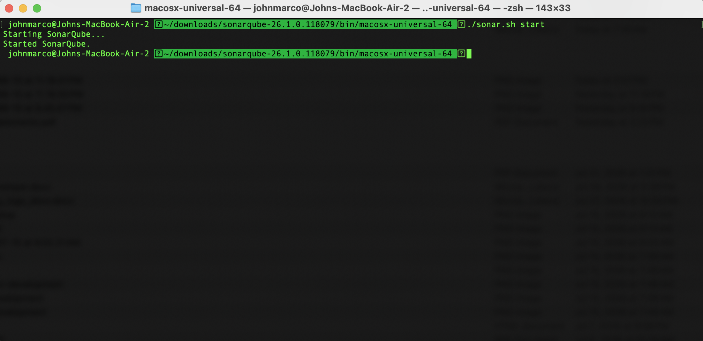

The terminal confirms `Started SonarQube.` — the server process has been launched successfully in the background.

---

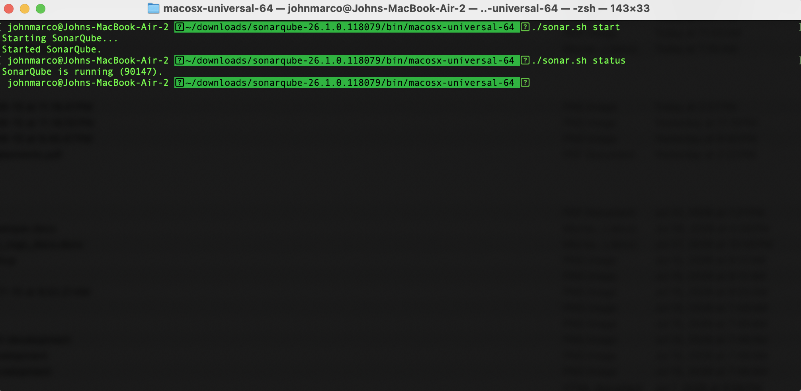

Running `sonar.sh status` confirms the process ID and that SonarQube is actively running. Wait until this shows `SonarQube is running` before opening the browser.

---

### Step 4 — Log In

Open **http://localhost:9000** and log in with `admin` / `admin`.

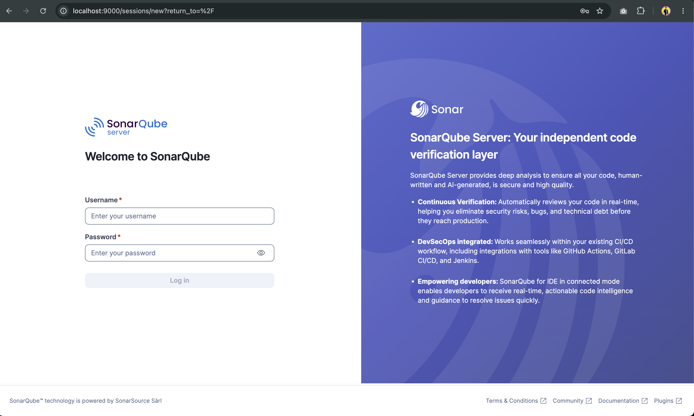

The SonarQube login page at `http://localhost:9000`. Use the default credentials `admin` / `admin` on first login. You will be prompted to change the password immediately after.

---

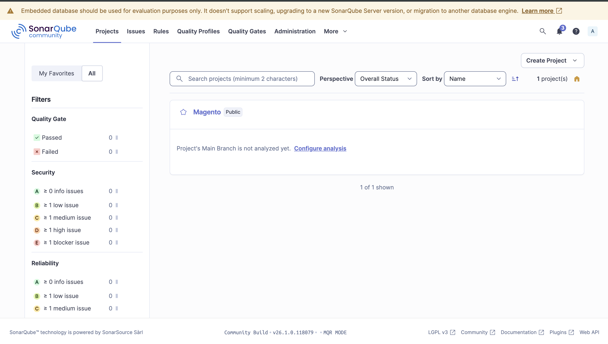

The main SonarQube dashboard after logging in. This is the central hub where all scanned projects appear, showing their overall quality status, gate results, and metrics at a glance.

---

### Step 5 — Install SonarScanner CLI

```bash
brew install sonar-scanner
```

```bash
sonar-scanner --version
```

**Or download directly:** [SonarScanner CLI](https://docs.sonarsource.com/sonarqube/latest/analyzing-source-code/scanners/sonarscanner/)

---

### Step 6 — Create a Project

1. Click **"Create Project"** → **"Local Project"**
2. Enter a Project key and Display name
3. Click **"Set Up"** → **"Locally"**

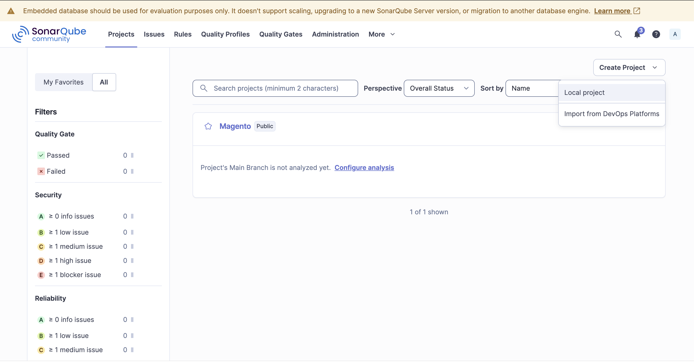

Click **Create Project** → **Manually** to set up a new project. Enter a unique project key and display name that will identify your project in the dashboard.

---

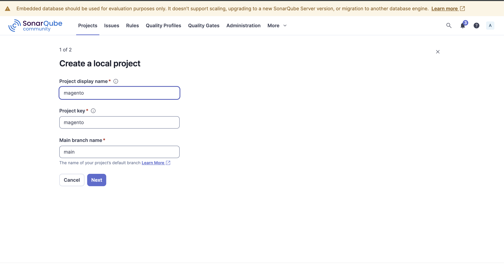

Select **Locally** as the analysis method. This means the scan will be triggered manually from your machine using the SonarScanner CLI rather than through a CI/CD pipeline.

---

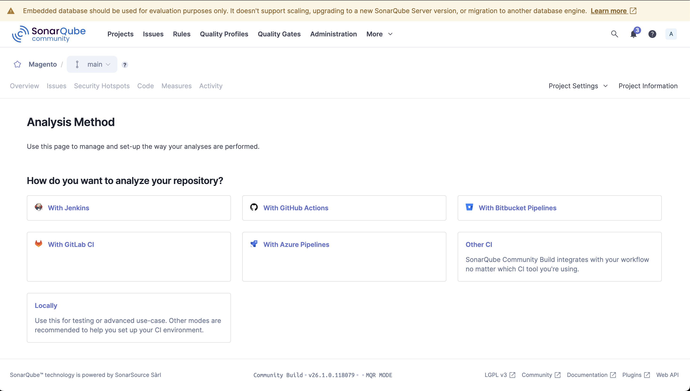

SonarQube provides the exact `sonar-scanner` command pre-filled with your project key and host URL. Copy this command — you will use it in your terminal to run the scan.

---

### Step 7 — Generate a Token

Generate a token and copy it — you'll need it to run the scanner.

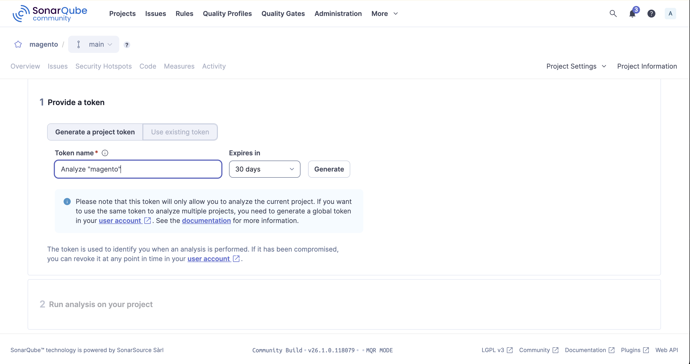

Generate a project analysis token. This token authenticates the SonarScanner with the SonarQube server. Copy and store it securely — it will not be shown again after you leave this page.

---

### Step 8 — Run the Scanner

Navigate to your project root and run:

```bash
sonar-scanner \
  -Dsonar.projectKey=<YOUR_PROJECT_KEY> \
  -Dsonar.sources=. \
  -Dsonar.host.url=http://localhost:9000 \
  -Dsonar.token=<YOUR_GENERATED_TOKEN>
```

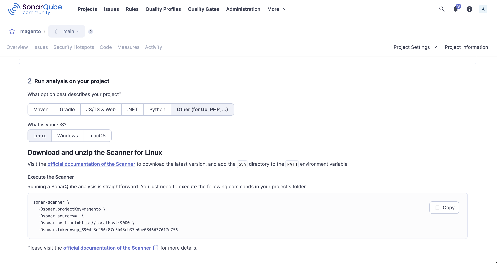

Run the `sonar-scanner` command from your project root in the terminal. The scanner analyzes your source code and sends the results to the SonarQube server.

---

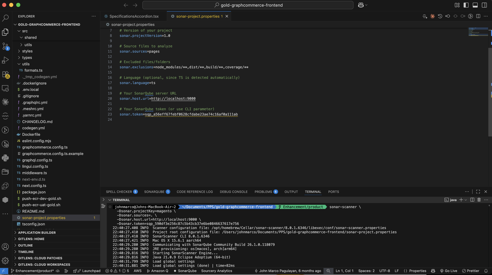

The scanner output in the terminal shows the analysis progress — files being indexed, sensors running (Java, Python, JS, etc.), and finally `EXECUTION SUCCESS` confirming the scan completed and results were uploaded.

---

### Step 9 — View Results

Open **http://localhost:9000/dashboard?id=<YOUR_PROJECT_KEY>**

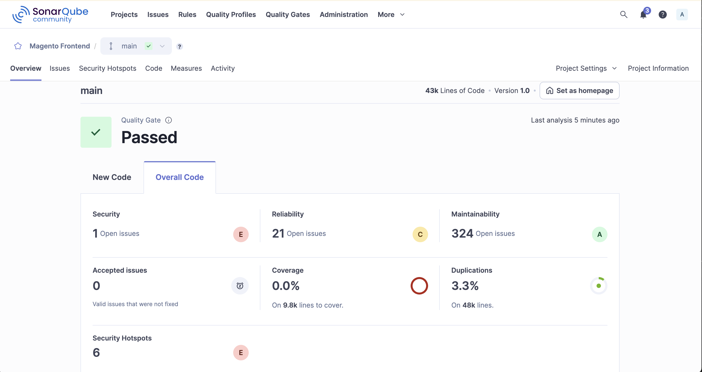

The project dashboard after a completed scan. It shows the overall Quality Gate status (Passed/Failed) along with a summary of Bugs, Vulnerabilities, Security Hotspots, Code Smells, Coverage, and Duplications found in the codebase.

---

## Visual Walkthrough

Detailed view of each result category in the SonarQube dashboard.

---

### Security Open Issues

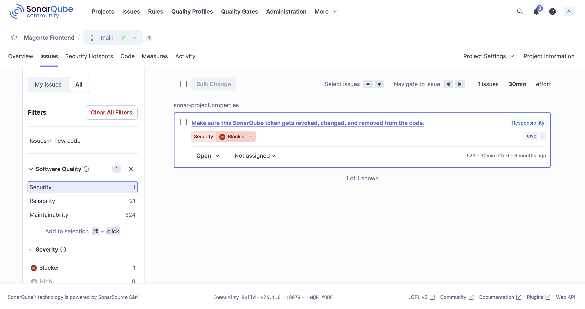

Lists all security vulnerabilities detected in the code — such as SQL injection, hardcoded credentials, or insecure API usage. Each issue shows the severity (Blocker, Critical, Major), the affected file, and the line number.

---

### Reliability Open Issues

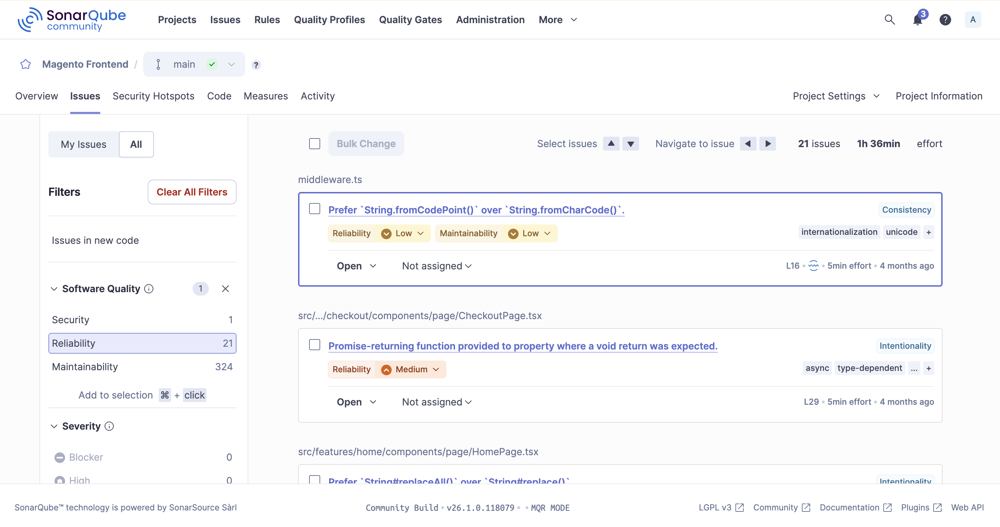

Shows bugs that will cause incorrect behavior or crashes at runtime — such as null pointer dereferences, resource leaks, or incorrect exception handling. These are issues that directly impact application stability.

---

### Maintainability Open Issues

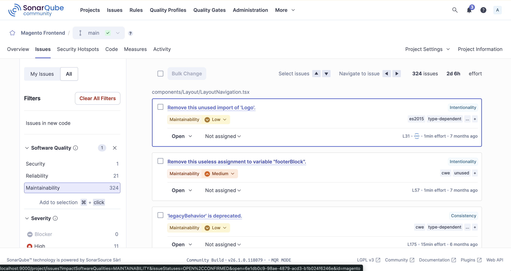

Lists code smells — issues that don't break functionality but make the code harder to read, maintain, or extend over time. Examples include overly complex methods, duplicated logic, and unused variables.

---

### Duplication Open Issues

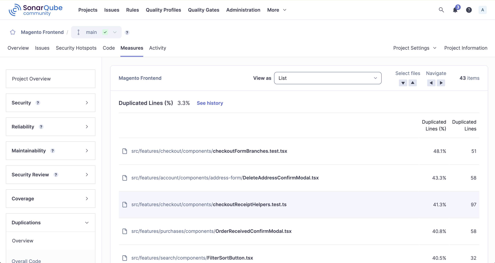

Highlights blocks of duplicated code across the project. High duplication increases maintenance cost — a bug fix or change in one place must be repeated in all duplicated locations, increasing the risk of inconsistencies.

---

### Security Hotspot Open Issues

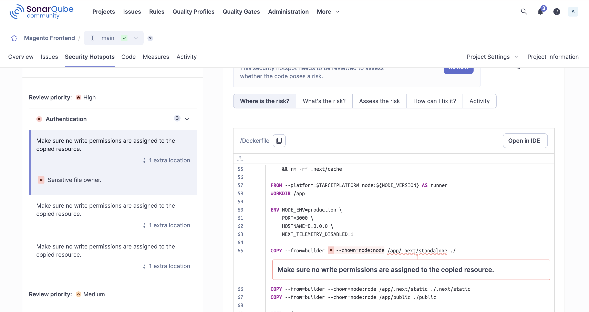

Security hotspots are code areas that require a manual security review — they are not confirmed vulnerabilities but are sensitive patterns (e.g., use of cryptography, file paths, or user input) that a developer should inspect and mark as safe or as a real issue.

---

### Quality Gates

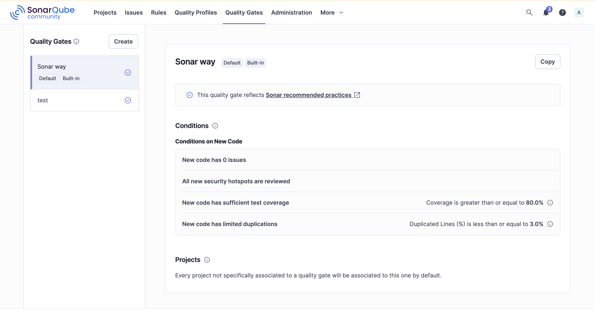

Quality Gates define the pass/fail conditions for a project scan. The default gate (Sonar Way) fails the build if new code introduces bugs, vulnerabilities, or drops below coverage thresholds. A failed Quality Gate blocks deployment in a CI/CD pipeline.

---

## Configuration File (Optional)

Instead of passing flags every time, create a `sonar-project.properties` file in your project root:

```properties
sonar.projectKey=<YOUR_PROJECT_KEY>
sonar.projectName=<YOUR_PROJECT_NAME>
sonar.projectVersion=1.0
sonar.sources=.
sonar.host.url=http://localhost:9000
sonar.token=<YOUR_GENERATED_TOKEN>
sonar.exclusions=**/node_modules/**,**/*.md,**/venv/**,**/__pycache__/**
sonar.sourceEncoding=UTF-8
```

Then simply run:

```bash
sonar-scanner
```

---

## Stopping SonarQube

```bash
~/sonarqube/bin/macosx-universal-64/sonar.sh stop
```

---

## AWS CodePipeline Integration

### Objectives

- Automatically scan every code change before it reaches production
- Enforce quality gates to block deployments with critical bugs or vulnerabilities
- Give developers immediate feedback on code quality within the CI/CD workflow
- Maintain a consistent, auditable code quality standard across all environments

---

### Advantages

| Advantage | Description |
|-----------|-------------|
| Shift-left security | Catches vulnerabilities early before deployment |
| Automated enforcement | Quality gates block bad code automatically |
| Visibility | Every pipeline run produces a linked SonarQube report |
| Cost reduction | Fixing bugs early is cheaper than fixing them in production |
| Compliance | Audit trail of code quality checks per deployment |
| Developer feedback | Instant feedback without leaving the CI/CD workflow |

---

### Requirements

| Requirement | Details |
|-------------|---------|
| AWS Account | Permissions for CodePipeline, CodeBuild, IAM, Secrets Manager |
| SonarQube Server | Hosted on EC2/ECS or use [SonarCloud](https://sonarcloud.io/) |
| SonarQube Token | Generated from SonarQube dashboard, stored in Secrets Manager |
| Source Repository | CodeCommit, GitHub, or Bitbucket connected to CodePipeline |
| buildspec.yml | CodeBuild build spec in your project root |
| IAM Role | CodeBuild service role with Secrets Manager access |

---

### Architecture Overview

```
Source (CodeCommit / GitHub)
        ↓
AWS CodePipeline
        ↓
  [Stage 1] Source
        ↓
  [Stage 2] Build & Scan (CodeBuild)
        ├── Run sonar-scanner
        └── Check Quality Gate → FAIL pipeline if gate fails
        ↓
  [Stage 3] Deploy (only if Quality Gate passes)
```

---

### Step-by-Step Setup

#### Step 1 — Store SonarQube Token in Secrets Manager

```bash
aws secretsmanager create-secret \
  --name sonarqube/token \
  --secret-string '{"SONAR_TOKEN":"<YOUR_TOKEN>","SONAR_HOST_URL":"http://<YOUR_HOST>:9000"}'
```

---

#### Step 2 — Create IAM Role for CodeBuild

Attach to your CodeBuild service role:
- `AWSCodeBuildDeveloperAccess`
- Inline policy scoped to the secret:

```json
{
  "Version": "2012-10-17",
  "Statement": [
    {
      "Effect": "Allow",
      "Action": "secretsmanager:GetSecretValue",
      "Resource": "arn:aws:secretsmanager:<REGION>:<ACCOUNT_ID>:secret:sonarqube/token*"
    }
  ]
}
```

---

#### Step 3 — Create `buildspec.yml`

```yaml
version: 0.2

env:
  secrets-manager:
    SONAR_TOKEN: sonarqube/token:SONAR_TOKEN
    SONAR_HOST_URL: sonarqube/token:SONAR_HOST_URL

phases:
  install:
    runtime-versions:
      java: corretto21
    commands:
      - wget https://binaries.sonarsource.com/Distribution/sonar-scanner-cli/sonar-scanner-cli-6.2.1.4610-linux-x64.zip
      - unzip sonar-scanner-cli-6.2.1.4610-linux-x64.zip
      - export PATH=$PATH:$(pwd)/sonar-scanner-6.2.1.4610-linux-x64/bin

  build:
    commands:
      - sonar-scanner
          -Dsonar.projectKey=<YOUR_PROJECT_KEY>
          -Dsonar.sources=.
          -Dsonar.host.url=$SONAR_HOST_URL
          -Dsonar.token=$SONAR_TOKEN

  post_build:
    commands:
      - |
        STATUS=$(curl -s -u $SONAR_TOKEN: "$SONAR_HOST_URL/api/qualitygates/project_status?projectKey=<YOUR_PROJECT_KEY>" | python3 -c "import sys,json; print(json.load(sys.stdin)['projectStatus']['status'])")
        echo "Quality Gate Status: $STATUS"
        if [ "$STATUS" != "OK" ]; then
          echo "Quality Gate FAILED. Blocking deployment."
          exit 1
        fi
```

---

#### Step 4 — Create CodeBuild Project

```bash
aws codebuild create-project \
  --name sonarqube-scan \
  --source type=CODEPIPELINE,buildspec=buildspec.yml \
  --artifacts type=CODEPIPELINE \
  --environment type=LINUX_CONTAINER,computeType=BUILD_GENERAL1_SMALL,image=aws/codebuild/standard:7.0 \
  --service-role arn:aws:iam::<ACCOUNT_ID>:role/<CODEBUILD_ROLE_NAME>
```

---

#### Step 5 — Add SonarQube Stage to CodePipeline

Add a stage between **Source** and **Deploy**:

```json
{
  "name": "CodeQuality",
  "actions": [
    {
      "name": "SonarQubeScan",
      "actionTypeId": {
        "category": "Build",
        "owner": "AWS",
        "provider": "CodeBuild",
        "version": "1"
      },
      "configuration": {
        "ProjectName": "sonarqube-scan"
      },
      "inputArtifacts": [{ "name": "SourceOutput" }],
      "outputArtifacts": [{ "name": "ScanOutput" }]
    }
  ]
}
```

---

#### Step 6 — Verify the Pipeline

1. Push a code change to trigger the pipeline
2. Open **AWS CodePipeline** and watch the `CodeQuality` stage
3. Quality Gate passes → pipeline continues to Deploy
4. Quality Gate fails → pipeline stops and notifies the team

---

### Pipeline Error Resolution & Responsibilities

| Error | Cause | Resolution | Responsible |
|-------|-------|------------|-------------|
| `Quality Gate FAILED` | Code exceeds bug/vulnerability/smell thresholds | Fix flagged issues in SonarQube dashboard, re-push | **Developer** |
| `SONAR_TOKEN: secret not found` | Secret missing or IAM role lacks permission | Verify secret in Secrets Manager; check IAM policy | **DevOps / Cloud Engineer** |
| `sonar-scanner: command not found` | Scanner not installed in buildspec | Check install commands in `buildspec.yml` | **DevOps / Developer** |
| `Connection refused to SonarQube host` | Server down or unreachable from CodeBuild | Check server status; verify security group rules | **DevOps / Cloud Engineer** |
| `401 Unauthorized` | Invalid or expired token | Regenerate token and update Secrets Manager | **DevOps / Developer** |
| `403 Forbidden` | Token lacks project permission | Grant `Execute Analysis` permission in SonarQube | **SonarQube Admin** |
| `CodeBuild exit code 1` | Build or scan script error | Check CloudWatch logs for the exact error | **DevOps / Developer** |
| `Pipeline not triggering` | Webhook or source connection misconfigured | Verify source connection and webhook setup | **DevOps / Cloud Engineer** |
| `Timeout during scan` | Large codebase or slow server | Increase CodeBuild timeout; tune `sonar.exclusions` | **DevOps / Developer** |

---

### Notification Setup (Optional)

```bash
aws codestar-notifications create-notification-rule \
  --name sonarqube-pipeline-alerts \
  --resource arn:aws:codepipeline:<REGION>:<ACCOUNT_ID>:<PIPELINE_NAME> \
  --event-type-ids codepipeline-pipeline-stage-execution-failed \
  --targets Type=SNS,Address=arn:aws:sns:<REGION>:<ACCOUNT_ID>:<SNS_TOPIC_NAME>
```

---

## Troubleshooting

| Issue | Fix |
|-------|-----|
| SonarQube fails to start | Ensure `SONAR_JAVA_PATH` points to JDK 21: `export SONAR_JAVA_PATH=/opt/homebrew/opt/openjdk@21/bin/java` |
| Elasticsearch crashes on startup | Free up disk space — SonarQube needs at least 10GB free |
| Port 9000 already in use | Kill the process: `lsof -ti:9000 \| xargs kill -9` |
| Port 9001 already in use | Kill the process: `lsof -ti:9001 \| xargs kill -9` |
| Scanner can't connect to server | Ensure SonarQube is fully started before running the scanner |
| Permission denied on `sonar.sh` | Run: `chmod +x ~/sonarqube/bin/macosx-universal-64/sonar.sh` |

---

## Useful Commands

```bash
~/sonarqube/bin/macosx-universal-64/sonar.sh start
```

```bash
~/sonarqube/bin/macosx-universal-64/sonar.sh status
```

```bash
~/sonarqube/bin/macosx-universal-64/sonar.sh stop
```

```bash
tail -f ~/sonarqube/logs/sonar.log
```

```bash
tail -f ~/sonarqube/logs/es.log
```

```bash
sonar-scanner -X
```
